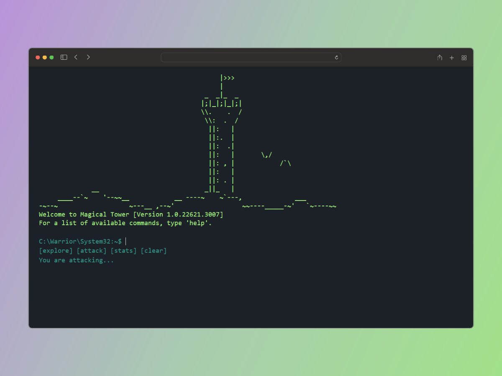

<h1 align="center">Magical Code Tower</h1>

## Descripción

Magical Tower es un juego de rol (RPG) en el que los jugadores se aventuran en una torre mágica llena de peligros y tesoros. Sumérgete en un mundo de fantasía, donde cada piso de la torre presenta desafíos únicos, enemigos formidables y secretos por descubrir.

## Instalación y Uso

- Descarga el repositorio
- Clickea en el archivo index.html de la carpeta `magical-tower`

## Contribución

Indica cómo pueden contribuir otros al proyecto. Esto podría incluir instrucciones para clonar el repositorio, cómo configurar el entorno de desarrollo, pautas para enviar solicitudes de extracción `(pull requests)`, etc.

1. Haz un fork del proyecto
2. Crea una nueva rama (git checkout -b feature/nueva-funcionalidad)
3. Realiza tus cambios y haz commits (git commit -am 'Agrega nueva funcionalidad')
4. Sube tus cambios (git push origin feature/nueva-funcionalidad)
5. Abre una solicitud de extracción (pull request)

## Soporte

Para obtener ayuda con el juego, contacta con nuestro equipo de soporte en [support@magicaltower.com](mailto:support@magicaltower.com)

## Licencia

Este juego está bajo la licencia **MIT**. Consulta el archivo LICENSE para más detalles.
